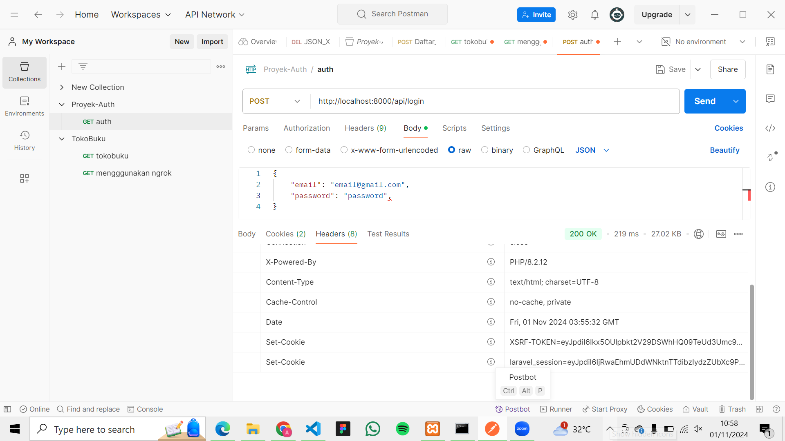
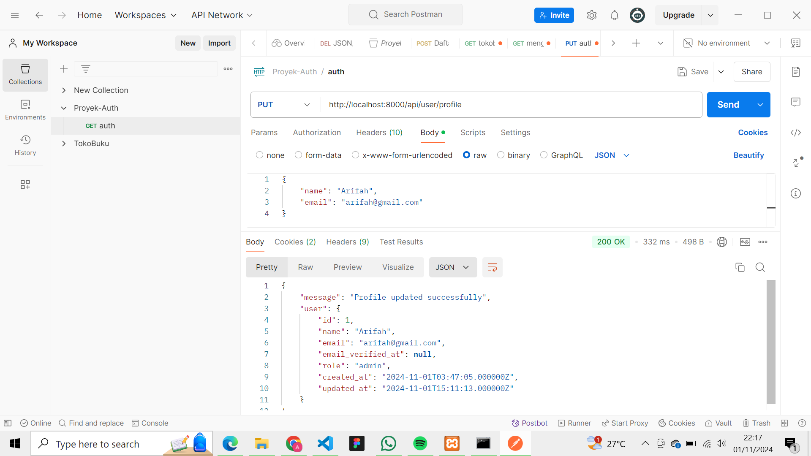
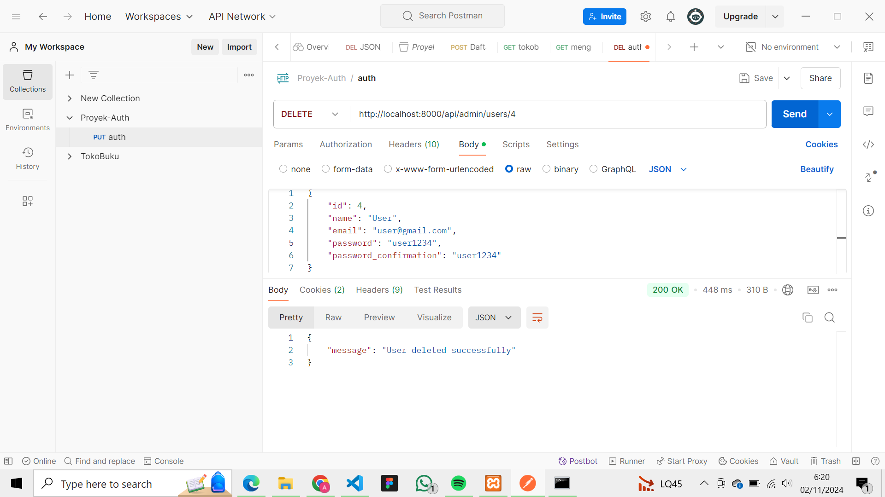

PRAKTIKUM
Register

Login

Akses rute admin

EVALUASI
1. Apa yang dimaksud dengan Laravel Sanctum?
Jawab :
Laravel Sanctum adalah paket autentikasi yang dikembangkan oleh Laravel untuk memungkinkan aplikasi membuat dan mengelola token API yang sederhana namun aman. Sanctum dirancang untuk aplikasi yang membutuhkan autentikasi berbasis token.

2. Bagaimana cara mengelola token autentikasi di Laravel?
Jawab :
Berikut ini adalah cara untuk mengelola token autentikasi di Laravel:
- Membuat token dan memberikan kemampuan pada token dengan menggunakan createToken
- Menggunakan token untuk authentikasi menggunakan Bearer Token
- Menambahkan middleware pada rute API
- Memverifikasi kemampuan token
- Menghapus token
- Mengelola token di frontend
- Menetapkan kadaluarsa pada token

3. Sebutkan langkah-langkah untuk menambahkan otorisasi berbasis peran dalam API!
Jawab :
Berikut adalah langkah-langkah untuk menambahkan otorisasi berbasis peran dalam API menggunakan Laravel:
- Menambahkan kolom role pada tabel user
- Melakukan migrasi
- Mengatur nilai default role saat melakukan registrasi
- Membuat middleware untuk memeriksa peran
- Mendaftarkan middleware dalam Kernel.php
- Menambahkan middleware ke rute yang memerlukan akses berdasarkan peran
- Menguji implementasi

TUGAS
1. Menambahkan fitur untuk memperbarui profile pengguna

2. Mengimplementasikan sistem untuk menghapus pengguna dengan otorisasi admin.

3. Membuat API untuk mengambil daftar semua pengguna (hanya bisa diakses oleh admin).
